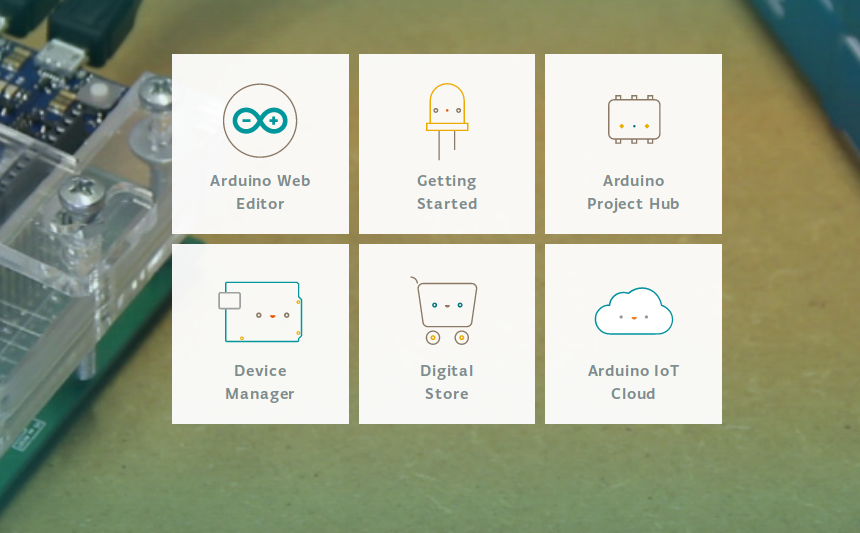

# Erstes Beispiel mit dem Arduino


Hier erfährst du wie du den Arduino anschließt, ein erstes Programm überträgst und wie du feststllen kannst das alles funktioniert.


Zuerst meldest du dich mit deinem zuvor erstellen Account auf [https://create.arduino.cc](https://create.arduino.cc/) an klickst den Web Editor an.

Spätestens jetzt muss du den Arduino mit einem USB-Kabel mit dem Computer verbinden. Warte ein bischen, damit das Betriebssystem Zeit hat das neue Gerät zu registrieren.

Wähle nun im Editor das Arduino-Board aus, welches du angeschlossen hast. Wir verwenden den Arduino/Genuino Uno.

Mit dem Haken wird das Programm überprüft und mit dem Pfeil auf das Arduino-Board übertragen. Führe dies nun mit dem Blink-Programm durch.

Wenn alles geklappt hat, dann sollte die LED auf dem Arduino nun blinken.

